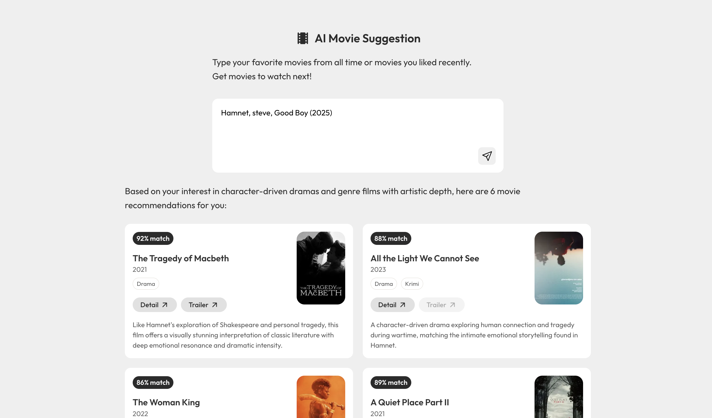

## What to Watch: AI Movie Suggestion

AI integrated Movie suggestion application.  
Generate 5 - 6 movies based on your interests and taste.

## Demo

You can try this locally.<br />
It requires [Anthropic API key](https://console.anthropic.com/) and [TMDB Access Token](https://developer.themoviedb.org/docs/getting-started).

## Features

- AI suggest 5 - 6 movies based on your interests
- Integrated TMDB API for accurate suggestions and user friendly UI
- Enhanced, card-based results with detailed insights and direct access to trailers

## Getting Started (Locally)

```bash
# Clone this repo
git clone git@github.com:<YOUR_ID>/ai-movie-suggestion.git <PROJECT_NAME>

# Move to the appropriate directory
cd <PROJECT_NAME>

# Install npm package
npm install

# Run the project and see http://localhost:5173/
## run frontend locally
npm run dev

## run backend locally
npm run dev:api
```

## What You Need

- Node.js (Vite requires Node.js version 20.19+, 22.12+)
- [Anthropic API key](https://console.anthropic.com/)
- [TMDB Access Token](https://developer.themoviedb.org/docs/getting-started)

## Environment Setup

Create `.dev.vars` in the project folder.

```
ANTHROPIC_API_KEY=your_anthropic_api_key_here
TMDB_ACCESS_TOKEN=your_tmdb_access_token_here
```

Copy `wrangler.toml.example` to `wrangler.toml`.

Note: `.dev.vars` and `wrangler.toml` are gitignored for security (may contain secrets in production).

## Tech stack

**Frontend**

- Vite
- TypeScript
- React
- Emotion

**Backend**

- Hono (Backend)
- Anthropic Claude API
- TMDB API

**Tools**

- ESLint
- Prettier

### Backend

## Author

[@chocolat5](https://github.com/chocolat5)

## License

[The MIT License](https://opensource.org/licenses/MIT).
